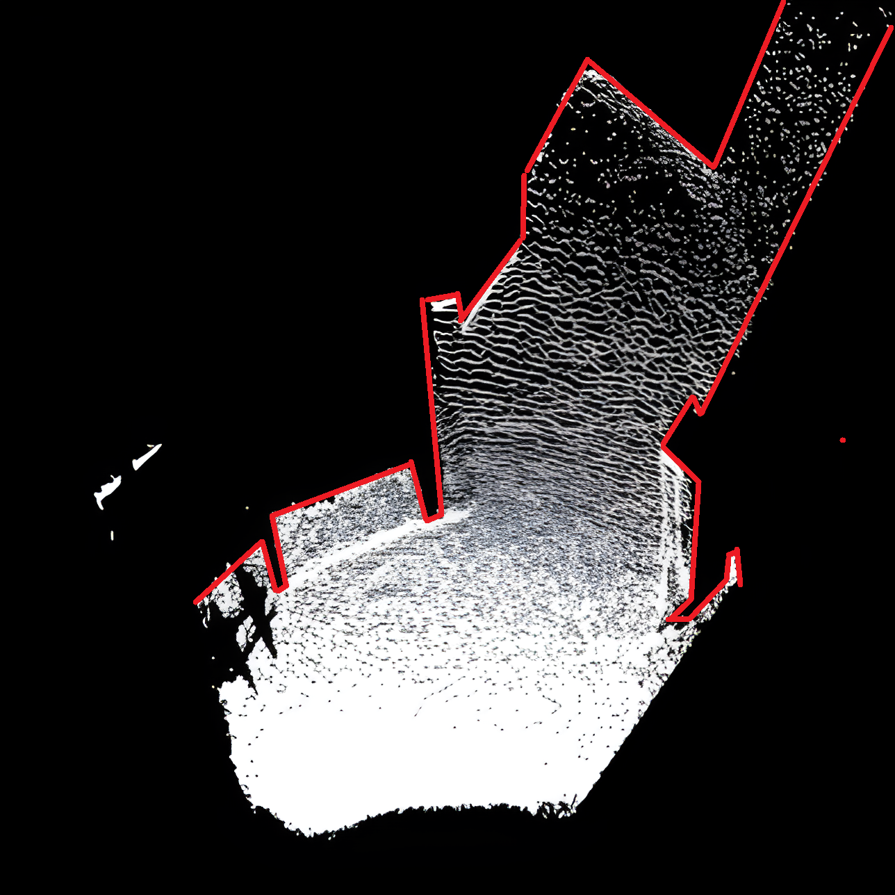
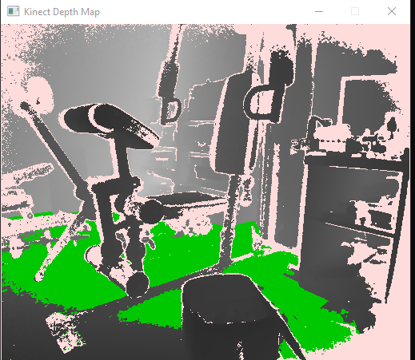

# Kinect Floor Detection Algorithm

This project implements a floor detection algorithm using an **Xbox One Kinect** and the **Kinect SDK 2.0**. The
algorithm highlights the detected floor in a depth image from the Kinect's camera and projects the floor into a *
*bird's-eye view**. Note that this is all using raw depth data from the Kinect sensor. It is not based on or built on
top of additional processing software, making it a fast and efficient solution for floor detection.

## Features

- **Real-time Floor Detection**: Identifies the floor in the Kinect camera's depth view and highlights it in **green**.
- **Bird's-Eye View Projection**: Transforms the detected floor into a top-down perspective, offering a **2D projection
  ** of the scene from above.
- **Dynamic Calibration**: Calibrates the floor height dynamically based on the average depth data.

## Demo

Here are two images demonstrating the floor detection algorithm:


   <div align="center">
     
 <br>
<strong>Bird's-Eye View</strong>: The floor is projected into a top-down, 2D perspective.<br>
Note that the true outline of available floor space is painted in **red**.
   </div>
<br>
   <div align="center">
     
<br>
<strong>Camera View</strong>: The floor is highlighted in **green** in the camera's depth view.
   </div>
## Setup

### Requirements

- Xbox One Kinect
- Kinect SDK 2.0
- C++ Compiler with support for Direct2D (for rendering) and Kinect SDK libraries
- Windows OS (recommended)

### Installation

1. **Clone the Repository:**

   ```bash
   git clone https://github.com/T-Lind/fast-floor-detection.git
   cd fast-floor-detection
   ```

2. **Ensure Kinect SDK 2.0 is installed:**

   Download and install the Kinect SDK 2.0
   from [Microsoft's Kinect for Windows SDK page](https://www.microsoft.com/en-us/download/details.aspx?id=44561).

3. **Compile the project:**

   Use your preferred C++ IDE or command-line tools to compile. Make sure to link the following libraries:
    - `Kinect20.lib`
    - `d2d1.lib` (for Direct2D rendering)

## Usage

### Running the Program

1. Connect the Xbox One Kinect to your PC.
2. Build and run the project.
3. The application will display:
    - A **camera view** where the floor is highlighted in **green**.
    - A **bird's-eye view** projection showing the 2D layout of the detected floor.

### Controls

- **Screenshots**: Use the in-app button to capture the current depth frame with floor detection.
- The detected floor pixels will be highlighted based on their depth in relation to the calibrated floor level.

### Calibration

The program automatically calibrates the floor height every 100 frames, adjusting the detection based on changes in the
environment.

## Project Structure

- `DepthBasics.cpp`: Manages the main application flow and handles Kinect sensor initialization and frame processing.
- `KinectProgram.cpp`: Implements the core floor detection logic, including:
    - **Depth frame analysis**: Extracts depth data and computes pixel positions.
    - **Floor detection**: Highlights floor pixels based on depth and projects them to the top view.
    - **Bird's-eye view transformation**: Converts 3D coordinates into a 2D top-down layout
- `ImageRenderer.cpp`: Handles the rendering of depth frames using Direct2D

## License

This project is licensed under the MIT License. See the `LICENSE` file for more details.
